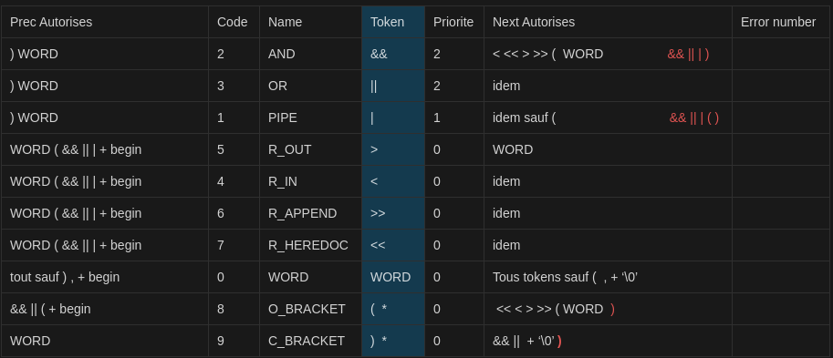

## Program structure : 

# <span style="color: rgb(26, 131, 10);">program : linebreak complete_commands linebreak | linebreak ;</span>  
program :  
-can be a series of complete cmds separated by line breaks  
ie :  
```bash
# linebreak (empty line)

echo "Hello, World!" # complete command

# linebreak (empty line)  
```
-can be just a line break  
ie : 
```bash
# linebreak (empty line)
```

checks to validate :
a line break followed by one or more `complete command` followed by another linebreak 
just a linebreak
linebreak = zero or more newline character

# <span style="color: rgb(26, 131, 10);">complete_commands: complete_commands newline_list complete_command | complete_command ;</span>  
complete_commands:  

-can be a single complete cmd  
ie :  
```bash
echo "Hello, World!"
```  
-can be several cmd on diff lines  
ie :  
```bash
echo "Hello, World!"  

echo "Another command"  
```  

# <span style="color: rgb(26, 131, 10);">complete_command : list ;</span>  
complete_command :  
-just a list of cmds  (it's a sequence of one or more pipelines separated by operators)
ie :  
```bash
cat file.txt
```  

checks to validate :
can be a list with a separator 
can be just a list 

# <span style="color: rgb(26, 131, 10);">list : list  separator_op  pipeline | pipeline ;</span> 
list : 
-can be another list followed by a separator_op and  a pipeline 
ie : 
```bash
echo "Hello, World!" && echo "Hello again, World!" | tr '[:lower:]' '[:upper:]'
```
-just a pipeline
ie : 
```bash
echo "Hello, World!" | wc  
```  

checks to validate :
check for a pipeline (|)
check for list operator (&& ||)
check for another pipeline (repeat the pipeline check)
check for termination (\n)
repeat steps 2-4 until all tokens are checked

if we can group all the tokens into "Pipelines" separated and optionally terminated by the correct operators, then the tokens respect the "List" rule.

pipeline (can be a single command)
# <span style="color: rgb(26, 131, 10);">pipeline : pipe_sequence ;</span>  
pipeline :  a pipeline is a sequence of one or more commands separated by the pipe operator (|). The output of each command is passed as input to the next command.
-can be a sequence of cmds separated by | 
ie : echo "hello" | echo "world"
```bash
echo "hello" | echo "world"
```  
-can be a single cmd without | at the end 
ie : echo "hello"
```bash
echo "hello"
```  

checks to validate : 
command 
simple command
command prefix
command word
command suffix
redirect list
I/O redirection
filename


# <span style="color: rgb(26, 131, 10);">pipe_sequence : command | pipe_sequence '|' linebreak command ;</span>  
pipe_sequence :  
-can be a single cmd 
ie : ls
```bash
ls
``` 
-can be a single cmd with a pipe 
ie : | 
```bash
ls | grep .txt
``` 
-can be a sequence of pipes  
ie : |    |    |    |
```bash
ls | grep .txt | wc -l
```  

checks to validate : 
check for the pipe operator (if there is one it split the command into two riht and left of the pipe)
check the command rule
check for redirections


# <span style="color: rgb(26, 131, 10);">and_or : pipeline | and_or AND_IF linebreak pipeline | and_or OR_IF linebreak pipeline ;</span>  
and_or :  
-can be a pipeline of cmds  
ie :  echo "Hello, World!" | echo "Hello, World!" | echo "Hello, World!"
```bash
echo "Hello, World!" | echo "Hello, World!" | echo "Hello, World!"
``` 
-can be and_or cmd followed by && or || and a pipeline cmd  
ie :  cd /my/directory && echo "Changed directory successfully" 
```bash
cd /my/directory && echo "Changed directory successfully" 

cd /non/existent/directory || echo "Failed to change directory"
```    

checks to validate : 
check for pipeline 
if ok check for the && or || operators
if ok but not followed by || and && ok because single pipeline
if not a valid pipeline and not followed by || or && not valid


## Command structure : 

# <span style="color: rgb(26, 131, 10);">command : simple_command | simple_command redirect_list  ;</span>  
command : 
-can be a simple cmd  
ie :  ls -l
```bash
ls -l
```  
-can be a simple cmd followed by a list of redirections  
ie :  echo "Hello, World!" > output.txt
```bash
echo "Hello, World!" > output.txt
```  

checks to validate : 
check for a simple command 
check for a simple command followed by a redirect list 


# <span style="color: rgb(26, 131, 10);">simple_command : cmd_prefix cmd_word cmd_suffix | cmd_prefix cmd_word | cmd_prefix | cmd_name cmd_suffix | cmd_name ;</span>  
simple command :  
-can be a cmd_prefix followed by a cmd_word and a cmd_suffix  
ie :  PATH=/usr/local/bin echo "Hello, World!"
```bash
PATH=/usr/local/bin echo "Hello, World!"
```  
-can be a cmd_prefix followed by a cmd_word  
ie :  PATH=/usr/local/bin echo
```bash
PATH=/usr/local/bin echo
```  
-can be just a cmd prefix  
ie :  export VAR=1
```bash
export VAR=1
```  
-can be a cmd_name followed by a cmd_suffix or  
ie :  echo $VAR
```bash
echo $VAR
```   
-can be just a cmd_name  
ie :  echo
```bash
echo
``` 

checks to validate : 
check for cmd prefix followed by a cmd_word and a cmd_suffix
check for cmd_prefix followed  by a cmd_word 
check for just cmd_prefix
check for cmd_word followed by a cmd_suffix
check for just cmd_word 


# <span style="color: rgb(26, 131, 10);">cmd_name : WORD / Apply rule 7a / ;</span>  
cmd_name : is a word (refer to the name of the cmd)  
ie :  echo
```bash
echo
```  

checks to validate : 
check if the cmd_name is a single word ((!IFS))
check if the cmd_name is a valid command in the system (path or built-in)
check if the cmd_name does not contain illegal char ($, `, \, ", ', |, &, ;, (, ), <, >, {, }, [, ], *, ?, ~, !, #, ^)
check if the cmd_name isn't followed by an = (assignement not command)


# <span style="color: rgb(26, 131, 10);">cmd_word : WORD / Apply rule 7b / ;</span>  
cmd_word : is a word typically an argument or option to a command
ie :  "hello world"
```bash
echo "hello world"
```  
here hello world is the cmd_word (an argument to echo)  

checks to validate : 
check if the cmd_word is a single word or a string enclosed in quotes (!IFS)
check if the cmd_word does not contain illegal char ($, `, \, ", ', |, &, ;, (, ), <, >, {, }, [, ], *, ?, ~, !, #, ^)
check if thecmd_word isn't followed by an = 
check if the cmd_word is a valid argument or option for the cmd it is associated with (try in a fork ?)
check if the cmd_word isn't a reserved word (if, then, else, fi, do, done, case, esac, while, until, for)

# <span style="color: rgb(26, 131, 10);">cmd_prefix : io_redirect | cmd_prefix io_redirect | ASSIGNMENT_WORD | cmd_prefix ASSIGNMENT_WORD ;</span>
cmd_prefix : it precedes the command name and command word in a simple command
-can be an I/O redirection
ie : >
```bash
command > output.txt
```  
-can be an assignement word
ie : VAR=value
```bash
VAR=value command
```  
-can be a combinaison 
ie : VAR=value  >
```bash
VAR=value command > output.txt
```  

checks to validate : 
format VAR=value no spaces around =
VAR must be a valid identifier (start with a letter (a-z, A-Z) or underscore and can be followed by any number of letters digits or underscores) ($, `, \, ", ', |, &, ;, (, ), <, >, {, }, [, ], *, ?, ~, !, #, ^, except if '' or "")
value can be any string if it contains spaces or special char it must be quoted
check for a redirection
check for a prefix and a redirection
check for an assignement word
check for a cmd_prefix and an assignement

# <span style="color: rgb(26, 131, 10);">cmd_suffix : io_redirect | cmd_suffix io_redirect | WORD | cmd_suffix WORD ;</span>
cmd_suffix : it follows the command name and command word in a simple command 
-can be a redirection
ie : >
```bash
echo "Hello, World!" > output.txt
```  
-can be a word
ie : "Hello, World!"
```bash
echo "Hello, World!"
```  
-can be a cmd_suffix followed by a word
ie : "Hello, World!" "How are you?"
```bash
echo "Hello, World!" "How are you?"
```  
-can be a combination
ie : "Hello, World!" > output.txt
```bash
echo "Hello, World!" > output.txt
```  

checks to validate : 
check for redirection 
check for word (cmd, variable name, string) if the next token is a word the parse move to the next token and the word becomes part of the cmd_suffix
cmd_suffix io_redirect and cmd_suffix WORD: These are recursive checks that allow for multiple redirections and/or arguments. The cmd_suffix rule can refer to itself, allowing for sequences of words and redirections.


## redirection and assignement : 

# <span style="color: rgb(26, 131, 10);">redirect_list : io_redirect | redirect_list io_redirect ;</span>
redirect_list_io_redirect : 
-can be a single redirection
ie : >
```bash
command > output.txt
```  
-can be a list of redirections
ie : > output.txt > output2.txt
```bash
command > output.txt > output2.txt
```  
in this case the two files are created but the output2.txt override the first redirection.  

checks to validate : 
presence of redirection operator < > >>
checks for a filename after the redirection

  
# <span style="color: rgb(26, 131, 10);">io_redirect : io_file | io_here ;</span>
I/O_number io_here : 
-can be an I/O file
ie :  >
```bash
command > output.txt
```    
-can be an I/O here
ie :  <<
```bash
command << EOF
Hello, World!
EOF
```  

checks to validate : 
check for redirection operators
check for here_doc
check filename


# <span style="color: rgb(26, 131, 10);">io_file : '<' filename  | '>' filename | DGREAT filename ;</span>
io_filename : 
-can be a left_redir followed by a filename (input from the file)
ie : <
```bash
command < input.txt
```  
-can be a right_redir followed by a filename (output to the file )
ie : >
```bash
command > output.txt
```  
-can be a DGREAT followed by a filename (appending to an existing file)
ie : >>
```bash
command >> output.txt
```  
checks to validate : 
check for redirection operators
check for optionnal whitespaces around the redirection operator
check for filename after redirection
check for another redirection or the end of the command (end of the command = newline, logical operators, pipe, EOF? )


# <span style="color: rgb(26, 131, 10);">filename : WORD / Apply rule 2 / ;</span>
filename : is a word that represents the name of a file, it is used in conjunction with I/O redirection
ie : output.txt 
```bash
command > output.txt
```  
checks to validate : 
no null bytes '\0'inside the name
check if full path or just filename 
lenght limit set by PATH_MAX in limit.h (usually 4096 bytes) and 255 bytes for the filename
if * need the * to be escaped (\*) or quoted "*" '*'
any other special char


the file name should follow the convention (it should not contain the following characters: / \ ? % * : | " < >) but can be quoted if special char

# <span style="color: rgb(26, 131, 10);">io_here : DLESS here_end ;</span>
io_here : 
-can be a DLESS (<<) followed by here_end
ie : <<
```bash
cat << EOF
Hello, World!
EOF
```
checks to validate : 
valid delimiter, a word
check for the LIMITER (no spaces)
then reads and group them on a single string 
continue until it encounters the LIMITER at the beginning of the line with a newline or EOF

# <span style="color: rgb(26, 131, 10);">here_end : WORD / Apply rule 3 / ;</span>
here_end : is a word that marks the end of a here document used in conjunction with the DLESS
ie : EOF
```bash
cat << EOF
Hello, World!
EOF
```

checks to validate : 
the end delimiter must match the start delimiter 


word cannot include (except for quoted) any whitespaces or special char : ($, `, \, ", ', |, &, ;, (, ), <, >, {, }, [, ], *, ?, ~, !, #, ^)

echo "hello"
echo "world"


command can start with : token_word or token_par or token_redirect



*
if token = logic et prev = logic et !prev->prev -> unexpected prev
if token = logic et prev = right_par -> unexpected prev
if token = redir par et prev = logic -> unexpected prev
if token = left_par et prev = right_par -> unexpected prev
if token = redir et prev = right_par -> unexpected prev

if token = logic et prev = logic et prev->prev -> unexpected token
if token = redir et prev = redir -> unexpected token 
if token = par et prev = redir -> unexpected token
if token = logic et prev = redir -> unexpected token
if token = right_par et prev = left_par -> unexpected token

if token = >> > < << -> unexpected newline
if token = redir et prev = par -> unexpected newline

if token = left_par et prev = left_par  -> unexpected end of file */ 